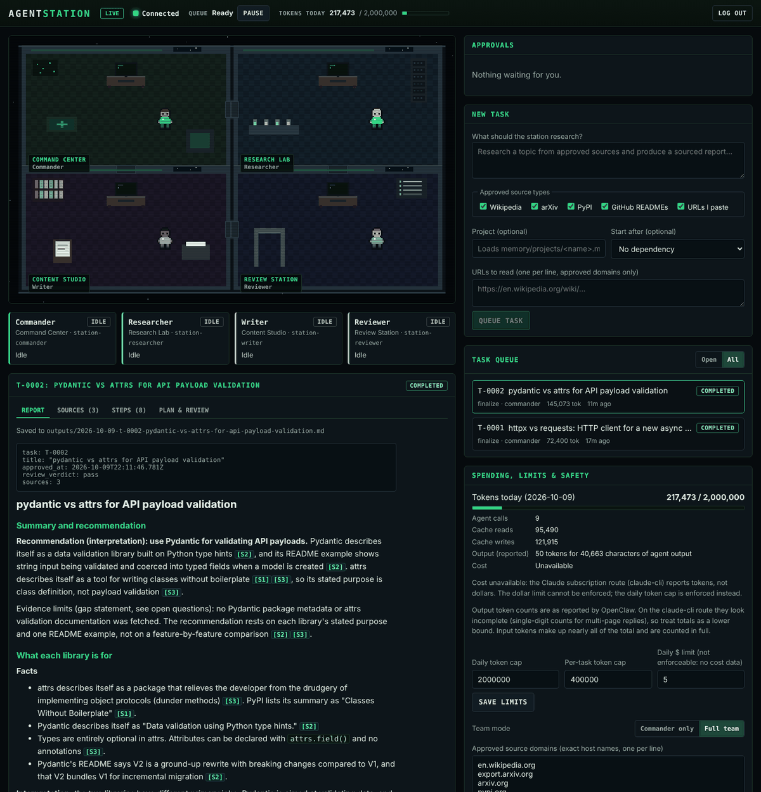

# AgentStation

A local command center for a small team of AI agents, shown as a top-down
pixel-art space station. Four OpenClaw agents (Commander, Researcher, Writer,
Reviewer) turn a request into a sourced research report. Every factual claim
is tied to a fetched source, and nothing leaves the machine without your
approval.



The dashboard shows what the backend reports. It does not make agents reliable
or profitable, and nothing here earns money on its own.

## How it works

```
your laptop                                  your VPS (everything bound to 127.0.0.1)
───────────                                  ────────────────────────────────────────
browser ──ssh tunnel──▶ AgentStation server :8787 ──Bearer token──▶ OpenClaw gateway :18789
                          │  task queue (SQLite)                      │  agents: station-commander,
                          │  approved-source fetcher                  │  -researcher, -writer, -reviewer
                          │  memory/  outputs/  staging/              ▼
                          │  external actions (gated)               claude-cli → your Claude subscription
```

**Workflow:** Request → Plan (Commander) → Fetch (station) → Research
(Researcher) → Draft (Writer) → Review (Reviewer, at most one automatic
revision) → **your approval** → Complete.

**The station does every side effect; agents only return text.** It fetches
from approved domains only, writes files, writes memory, and runs external
actions only after you approve them. The four agents have no working tools:
OpenClaw refuses their shell, file, and web calls, and `npm run probe:tools`
checks it by effect on every agent.

**The queue is explicit code, not a prompt.** It lives in SQLite with two
workers, per-stage timeouts, bounded retries, cancellation, idempotency keys,
compare-and-set state changes, and restart recovery. Task statuses are
`queued`, `running`, `awaiting_approval`, `completed`, `failed`, and
`cancelled`.

**Citations are checked by code.** Each Researcher finding must quote its
source exactly, and the station verifies the quote against the stored text.
The Writer cites `[S#]` IDs only. The station writes the Sources section
itself (URL, retrieval time, SHA-256 of the text the agents read), so URLs
cannot be invented.

**Integration uses only documented OpenClaw surfaces:** `POST /v1/responses`
with `x-openclaw-agent-id`, `GET /readyz`, and the documented CLI commands in
`scripts/setup-openclaw.sh`.

## Install on your VPS

Tested on Ubuntu 24.04. Run every command as the Linux user that will own the
station (a dedicated user is a good idea). Commands marked "laptop" run on your
own computer.

### 1. Prepare the server

Harden SSH access before installing anything (key-only login, firewall). The
OpenClaw docs cover this under "Linux server → Harden admin access first".
Nothing in this setup opens a public port.

### 2. Install OpenClaw (official installer)

```bash
curl -fsSL https://openclaw.ai/install.sh | bash -s -- --no-onboard
openclaw --version            # tested with 2026.9.9; Node 24.16+ or 26.1+ required
```

### 3. Log Claude Code in to your subscription, then onboard OpenClaw

```bash
# Install Claude Code first if needed (see its official setup docs at code.claude.com), then:
claude auth login
claude auth status --text
openclaw onboard --non-interactive --accept-risk \
  --mode local --auth-choice anthropic-cli --secret-input-mode ref \
  --gateway-bind loopback --gateway-auth token \
  --install-daemon --skip-channels --skip-search --skip-skills --skip-hooks --skip-ui
sudo loginctl enable-linger "$USER"     # keep the gateway running after you log out
openclaw gateway status                 # expect: Listening 127.0.0.1:18789
```

### 4. Get AgentStation and configure OpenClaw for it

```bash
# Until the branch is merged, clone it explicitly:
git clone -b claude/agentstation-command-center https://github.com/codypoirier2002-ui/claude-code.git ~/claude-code
ln -s ~/claude-code/AgentStation ~/AgentStation
cd ~/AgentStation
scripts/setup-openclaw.sh               # creates the 4 agents and locks them down (idempotent)
openclaw gateway restart                # only if the script says so
scripts/init-secrets.sh                 # creates ~/.agentstation/secrets.env (dashboard admin token)
```

`setup-openclaw.sh` does the following, using only documented commands:

- keeps the gateway on loopback with token auth, and backs the token with
  `~/.openclaw/.env` (mode 600) so the station server can read it
- enables `/v1/responses`
- turns off heartbeat and dreaming (background model calls), memory search,
  the browser, and elevated tools
- sets exec policy to `deny-all`, globally and for each agent
- stops agents from reading each other's sessions
- creates `station-commander`, `-researcher`, `-writer`, and `-reviewer` from
  OpenClaw's role templates, installs `agents/<role>/AGENTS.md`, and gives each
  `deny: ["*"]` tools, no skills, and no delegation

> The exec deny applies to the whole gateway, including OpenClaw's default
> `main` agent. If you also use OpenClaw for other things, give AgentStation
> its own gateway or OS user.

### 5. Build, verify, and start

```bash
cd ~/AgentStation/server && npm ci && npm test && npm run probe:tools
cd ~/AgentStation/dashboard && npm ci && npm run build
openclaw security audit --deep          # expect 0 critical; see docs/VERIFICATION.md for the 2 expected warnings
mkdir -p ~/.config/systemd/user
cp ~/AgentStation/deploy/agentstation.service ~/.config/systemd/user/
systemctl --user daemon-reload && systemctl --user enable --now agentstation
journalctl --user -u agentstation -n 20
```

`probe:tools` makes one real agent call per agent (about 20k tokens each). Run
it again after every OpenClaw or Claude Code update.

### 6. Open the dashboard (laptop)

```bash
~/claude-code/AgentStation/deploy/tunnel.sh you@your-vps
# open http://127.0.0.1:8787 and log in with the token from:
#   ssh you@your-vps 'grep STATION_ADMIN_TOKEN ~/.agentstation/secrets.env | cut -d= -f2'
```

Never expose port 8787 or 18789 publicly. The server also rejects any `Host`
header other than localhost.

## Configuration

| What | Where |
| --- | --- |
| Ports, timeouts, workers (max 2), default limits, approved domains, agent IDs, time zone | `config/station.json` |
| Daily and per-task token caps, dollar limit, team mode (Commander only / full team), approved domains | Dashboard → *Spending, limits & safety*. Stored in SQLite and overrides the file. |
| External action destinations | `config/station.json` → `actions.webhookAllowlist`. File-only on purpose; restart to apply. Empty means no external action can run. |
| Role instructions | `agents/<role>/AGENTS.md`; re-run `scripts/setup-openclaw.sh` after editing |
| Agent model | `STATION_MODEL=anthropic/claude-opus-5-5 scripts/setup-openclaw.sh` (default Sonnet 5.5) |
| Goals, rules, decisions, project notes | `memory/` (see `memory/README.md`) |
| Dashboard admin token | `~/.agentstation/secrets.env` (mode 600; the server refuses group- or world-readable files) |
| Gateway token | `~/.openclaw/.env` (mode 600) |

No secret is ever written to `config/`, `memory/`, logs, SQLite, git, or the
browser. The browser holds only an HttpOnly session cookie and a CSRF token.

### Spending limit

You asked for $5/day. The Claude subscription route reports **tokens, not
dollars**, so the station enforces a **daily token cap** instead and shows
"Cost unavailable" rather than inventing a figure.

The default of 2,000,000 tokens/day is roughly $5/day at Claude Sonnet 5.5 API
rates for this workload. A full team task measured about 145k reported tokens,
about $0.35 at API rates. There is also a 400,000-token per-task cap.

When the daily cap is reached, new agent calls stop and the dashboard says
why. A call already in progress can overshoot by one call.

On this route OpenClaw undercounts **output** tokens (single digits for
multi-page replies). Input tokens, which are about 99% of the total, are
counted in full. Treat the totals as a lower bound.

## Using it

1. **New task:** describe what to research, then pick the approved source
   types: Wikipedia, arXiv, PyPI, GitHub READMEs, or URLs you paste (approved
   domains only). Optionally add a project (loads
   `memory/projects/<name>.md`) or a dependency.
2. **Watch it:** a crew member walks to their workstation only while the
   backend reports their step running.
   - Amber `!`: waiting for you.
   - Red `x`: failed.
   - Green check: just finished.
   - `z`: standby (Commander-only mode).
   - Dimmed scene with **DISCONNECTED**: the link to the station or OpenClaw
     is down, and no agent is shown as working.
3. **Approve:** read the draft, the reviewer's issues, and the station's
   citation checks. Then choose **Approve & save** (writes to `outputs/` and
   updates memory), **Request changes** (with a note), or **Reject**. Tick any
   proposed decisions you want remembered.
4. **External actions:** if a request asks to send or publish something,
   Commander lists it and the station holds it as a separate approval. It runs
   only if you approve it, the report is approved, and its destination is
   allow-listed. It runs once, with an idempotency key, and is never resent
   automatically after a restart.
5. **Pause / cancel / retry:** *Pause* in the top bar stops new steps.
   *Cancel* aborts the running agent call. *Retry* restarts a failed task from
   the step that failed.

Memory works in plain Markdown and is Obsidian-compatible: open
`AgentStation/memory` as a vault. See `memory/README.md` for exactly what is
read and written, and when.

## Backup and recovery

```bash
scripts/backup.sh                 # → ~/agentstation-backups (mode 600)
scripts/backup.sh --station-only  # skip the OpenClaw archive
```

- **Station archive:** a consistent online copy of the SQLite database (with
  integrity check), plus `memory/`, `outputs/`, `staging/`, `config/`, and a
  SHA-256 file.
- **OpenClaw archive:** `openclaw backup create --verify`. It contains
  OpenClaw credentials, so store it encrypted.
- **Not included:** the two secrets files. Keep them in a password manager, or
  regenerate them (`scripts/init-secrets.sh`; delete the token line in
  `~/.openclaw/.env` and re-run `setup-openclaw.sh`).

To restore:

```bash
systemctl --user stop agentstation
scripts/restore.sh ~/agentstation-backups/agentstation-<stamp>.tar.gz   # keeps data/pre-restore-<stamp>/
systemctl --user start agentstation
# OpenClaw: openclaw backup restore <openclaw-archive> --target <fresh dir>   (stages files; see its docs)
```

Schedule backups with a systemd timer or cron, and copy them off the VPS.

## Demo Mode

```bash
cd server && npm run demo        # http://127.0.0.1:8788
```

Demo Mode uses scripted agents and sources, and makes no network or model
calls. It has its own database, memory copy, outputs folder, and port, and
every screen carries a striped **DEMO MODE** banner. It reports no usage, so
no token totals are invented.

## Implemented

- OpenClaw installed and hardened with documented commands only; four
  isolated agents built from OpenClaw role templates with station-specific
  instructions
- Tool lockdown checked live by effect (`probe:tools`): no Bash or Write
  canary file, no Read content returned, no WebFetch connection
- Memory read at task start and written at completion through fixed code
  paths, with a SHA-256 of the memory each stage saw
- SQLite task state:
  - fields: ID, description, assigned agent, status, created/updated times,
    dependencies, output location, approval requirement, error and detail,
    reported tokens, cost (when reported)
  - steps with attempts, timeouts, OpenClaw response IDs, and usage
- Explicit queue:
  - two workers, timeouts, bounded retries with backoff
  - non-transient errors fail fast
  - cancellation propagates to OpenClaw
  - idempotent task creation, compare-and-set approvals and completions
  - single-instance lock, crash recovery, clean-shutdown requeue
- Approved-source fetcher: https only, exact-host allowlist re-checked on every
  redirect, size and time limits, untrusted-content markers, verified quotes
- Approval gates for final reports, clarifications, and external actions
  (webhook executor with allowlist, idempotency key, `needs_review` after a
  crash mid-send)
- Daily and per-task token caps enforced from reported usage; explicit
  "cost unavailable" handling
- React + TypeScript + PixiJS dashboard:
  - four connected rooms with original pixel art and state-driven animation
  - task form, queue, agent status, activity history
  - output viewer: report, sources with hashes and exact text, step timeline,
    plan and reviews
  - approvals, pause / cancel / retry, limits, team mode, approved domains
  - live updates over SSE, "Disconnected" handling, phone layout, strict CSP
- Auth: admin token → HttpOnly session, CSRF on every control action,
  loopback `Host` and `Origin` checks, login rate limit
- Demo Mode, backup and restore, systemd unit, SSH tunnel helper
- 18 automated tests; seven live demonstrations (see `docs/VERIFICATION.md`)

## Limitations (read these)

- **No dollar cost on the subscription route.** The limit is a token cap.
  Output tokens are undercounted by OpenClaw on `claude-cli`, so totals are a
  lower bound.
- **About 20k tokens per agent call, minimum.** Claude Code's system prompt
  and the workspace files are sent on every call. A full team report costs
  roughly 100k–150k reported tokens.
- **Sandboxing is policy, not a container.** On the `claude-cli` route Claude
  Code runs on the host. OpenClaw's Docker sandbox does not apply; protection
  comes from OpenClaw's exec deny and PreToolUse hook. Native tool names still
  appear in the model's tool list (calls are refused). Re-run `probe:tools`
  after upgrades.
- **Research is limited to what the station can fetch.** That means
  Wikipedia, arXiv, PyPI metadata, GitHub READMEs (not issues or code), and
  pasted URLs on approved domains. There is no general web search, and
  HTML-to-text for arbitrary pages is basic.
- **Quote checks prove the quote exists, not that the claim is fair.** Reviewer
  and your approval are the safeguard for interpretation.
- **One operator, one admin token**; no roles or multi-user audit trail.
- **One external action type exists** (`webhook_post`), and its allowlist is
  empty by default. Email, publishing, purchasing, deletion, production
  changes, and account connections have no executor, so they are always
  refused even if approved.
- **Two OpenClaw audit warnings remain by design** (`trusted_proxies_missing`,
  device-less `probe_failed`); see `docs/VERIFICATION.md`.
- **Built and verified in a cloud container**, where only PyPI and GitHub
  content were reachable. Wikipedia and arXiv adapters are implemented but
  could not be exercised live there. Check them on your VPS with a small task.
- The scene needs WebGL; without it the panels still work and a notice is
  shown.

## Troubleshooting

| Symptom | Check |
| --- | --- |
| Dashboard says Disconnected (OpenClaw) | `openclaw gateway status`, `systemctl --user status openclaw-gateway` |
| `agentstation: no OPENCLAW_GATEWAY_TOKEN` | re-run `scripts/setup-openclaw.sh`, then `openclaw gateway restart` |
| Tasks stay queued | top bar: paused? hold banner (token cap, gateway not ready)? dependency not finished? |
| Fetch fails with HTTP 403 | the host is blocked by your network or by the site; see the error in the task |
| `OpenClaw … 401` | the token in `~/.openclaw/.env` changed but the gateway was not restarted |
| An agent should not be able to do X | `npm run probe:tools`, `openclaw exec-policy show --agent station-commander` |

## Next: one business integration at a time

Once this runs on your VPS, add integrations one at a time, each with its own
approval gate and allowlist entry. Good first steps are a "prepare product
listing copy" task type (drafting only, nothing published), or delivering
approved reports to a Slack or email webhook you control.
